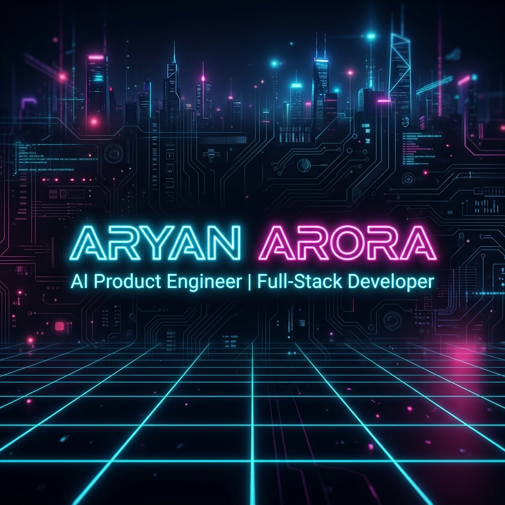

<p align="center">
  
</p>

<h1 align="center">⚡ ARYAN ARORA ⚡</h1>
<p align="center">
  <b>AI Product Engineer | Full-Stack Developer | Tech & Cybersecurity Enthusiast</b>
</p>

<p align="center">
  <a href="https://git.io/typing-svg"></a>
</p>

---

### 🌌 Profile Overview

First-year Computer Science student specializing in **AI-augmented product development** with a proven ability to architect and ship production-grade applications. Passionate about integrating LLMs/AI, rapid prototyping, and multi-modal system design. Has a strong track record of winning competitive hackathons and designing robust architectures.

```yaml
astral_projection:
  role: "AI Product Engineer | Full-Stack Developer"
  location: "Graphic Era University, Dehradun (PCM at The Aryan School)"
  core_passions: 
    - "Cybersecurity & Networking"
    - "AI, Deep Learning & NLP"
    - "Intelligent Systems & AI Orchestration"
    - "Multi-Modal AI & Computer Vision"
  fun_fact: "First place winner at IIT Roorkee hackathon"
```

---

### 🏆 Hackathon Achievements & Hall of Fame

<div align="center">
  <table>
    <tr>
      <td align="center"><b>Event</b></td>
      <td align="center"><b>Project / Role</b></td>
      <td align="center"><b>Result / Rank</b></td>
      <td align="center"><b>Details</b></td>
    </tr>
    <tr>
      <td><b>IIT Roorkee FinCortex Hackathon</b></td>
      <td><b>Synapse OS</b> (Multi-Agent Web OS)</td>
      <td>🏆 <font color="#00F0FF"><b>1st Place Winner</b></font></td>
      <td>Beat 200+ teams, built voice, gesture & multi-agent pipeline in 72 hours.</td>
    </tr>
    <tr>
      <td><b>Logixcape IEEE Hackathon</b></td>
      <td><b>Graphic Era University</b></td>
      <td>🏆 <font color="#FF007F"><b>1st Place Winner</b></font></td>
      <td>Ranked 1st among 300+ participants in logical debugging & escape room.</td>
    </tr>
    <tr>
      <td><b>Kindle Junior 4.0 (IEEE - GEU)</b></td>
      <td><b>CareerPath</b> (AI Career Platform)</td>
      <td>🏆 <font color="#00F0FF"><b>1st Place Winner</b></font></td>
      <td>Ranked 1st among 115+ students in multi-round technical competition.</td>
    </tr>
    <tr>
      <td><b>DigiTech Titans Hackathon</b></td>
      <td><b>District-Level Competition</b></td>
      <td>🏆 <font color="#FF007F"><b>1st Place Winner</b></font></td>
      <td>Completed 8 intensive technical challenges in 84 minutes.</td>
    </tr>
  </table>
</div>

---

### 🚀 Featured Projects

#### ⚡ [Synapse OS](https://github.com/FROSTY-MUG/Synapse-OS) – Multi-Agent AI Web Operating System
> **1st Place at IIT Roorkee FinCortex Hackathon | Feb 2026**
*   **Concept**: AI-powered Web OS enabling voice, gesture, and multi-agent workflows for real-time financial analysis.
*   **Implementation**:
    *   Built a multi-agent system integrating Gemini, GPT-4, and Groq with parallel execution and consensus mechanisms.
    *   Developed a high-performance RAG pipeline using Pinecone for contextual data retrieval.
    *   Engineered gesture control using MediaPipe (~32 FPS) and a multi-modal responsive UI.
    *   Integrated OAuth 2.0 (Google, Spotify) and implemented Firebase-based analytics.
*   **Tech Stack**: `Next.js 15`, `TypeScript`, `React 19`, `Firebase`, `MediaPipe`, `OpenAI`, `Google GenAI`, `Groq`, `Pinecone`, `Vercel`

#### 🔮 [CareerPath](https://github.com/FROSTY-MUG/CareerPath) – AI Career Guidance Platform
> **Winner – Kindle Junior 4.0 | Oct 2025**
*   **Concept**: AI-powered career recommendation system delivering personalized guidance through multi-stage assessment.
*   **Implementation**:
    *   Built full-stack application using Next.js and LLM APIs for intelligent recommendations.
    *   Implemented secure authentication, recommendation engine, and responsive UI.
    *   Deployed on Vercel with CI/CD via GitHub Actions.
*   **Tech Stack**: `Next.js`, `React`, `AI APIs (Gemini/GPT)`, `Vercel`, `GitHub Actions`

#### ✒️ [Voices of Ink](https://github.com/FROSTY-MUG/Voices-of-Ink) – AI Writing Platform
> **AI Product Design & Prompt Engineering | 2025**
*   **Concept**: AI writing platform with multiple personas featuring distinct emotional tones and styles.
*   **Implementation**:
    *   Designed 9 writing personas with unique tone and stylistic depth.
    *   Built low-detection architecture for human-like content generation.
*   **Tech Stack**: `Next.js`, `TypeScript`, `TailwindCSS`, `AI APIs`, `Vercel`

---

### 🛠️ Technical Stack & Skills

<details open>
<summary><b>🧠 AI, Deep Learning & NLP</b></summary>
<p align="left">
  
  
  
  
  
  
  
</p>
</details>

<details open>
<summary><b>💻 Programming Languages & Web Development</b></summary>
<p align="left">
  
  
  
  
  
  
  
  
  
</p>
</details>

<details open>
<summary><b>🛡️ Security, Networking & Backend Tools</b></summary>
<p align="left">
  
  
  
  
  
  
  
</p>
</details>

---

### 📊 GitHub Stats & Metrics

<p align="center">
  
  
</p>

<p align="center">
  
</p>

---

### 🤝 Leadership & Community

*   **Head of Logistics & Core Organizing Committee** | IGC Model United Nations, Dehradun | Nov 2025
    *   Managed end-to-end logistics and operations for 200+ delegates across a three-day international conference.
*   **Founder & President** | Computer Science Club | The Aryan School | 2024 - 2025
    *   Founded the technical club, organized 12+ project exhibitions and workshops for the student community.
*   **School Coordinator & Student Council Member** | The Aryan School | 2024 - 2025
    *   Coordinated logistics and technical operations for events hosting 400+ guests.

---

### 📬 Telecommunications / Connect

Feel free to ping me for collaborations on AI Orchestration, Cybersecurity projects, or deep learning systems!

<p align="left">
  <a href="mailto:aryanarora26110@gmail.com">
    
  </a>
  <a href="https://linkedin.com/in/aryan-arora-ai">
    
  </a>
  <a href="https://github.com/FROSTY-MUG">
    
  </a>
</p>
